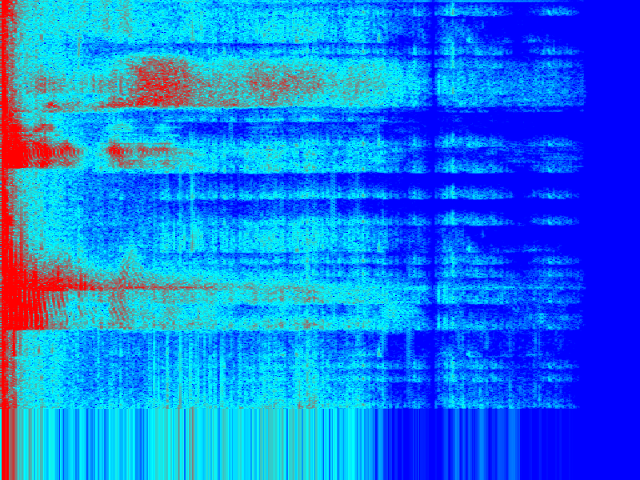

[Sgram TUI](https://s2.smu.edu/~ashamaei/projects/sgram-tui.html)
=========

Terminal spectrogram viewer with mic/WAV input, style-aware PNG export, and tunable DSP.

Install
-------
- Cargo (recommended)
  - `cargo install --locked --path .`
- From source
  - `cargo build --release && ./target/release/sgram-tui --help`
  - Linux mic deps: `sudo apt-get install -y pkg-config libasound2-dev`

Why?
--------
- GUIs provide a visually more accurate image, so why use a TUI?
- A lot of my audio workflows are on the terminal. I wanted a way to access a spectogram without switching from my terminal to a GUI.
- scope-tui does a good job displaying X and XY graphs, sgram-tui intends to extend this functionality by adding a specogram.
- This is the equivalent of the $50 oscilloscope: it's a fun toy that gives you the ability to see a spectogram inside of a terminal... neat!

What's with the name?
--------
- it's a spectogram terminal user interface... I'm not sure if it gets simpler than that.

Features
--------
- Live spectrogram from `mic` or `.wav`
- Tunable analysis: window length (L), hop (H), FFT size (N), sample rate
- Absolute dB with floor/ceiling; fast floor control
- Zoom; frequency scales: linear, log, mel
- Styles: horizontal (time→x, freq→y) and waterfall (time→y, freq→x); overview + fullscreen
- Palettes: Grayscale, Heat, Jet, Viridis, Inferno, Magma, Plasma, PurpleFire
- Fast rendering; real-time sync option for WAV
- Exports: PNG (matches current style/scale/zoom) and CSV; default dir: `saved/`

Build
-----
- Requires Rust 1.70+ (edition 2021)
- Default build includes microphone support via `cpal`:
  - `cargo build --release`
- If you want to skip microphone feature: `cargo build --no-default-features`

Quick Start
-----------
- Live mic (macOS BlackHole example):
  - `./target/release/sgram-tui mic --device "BlackHole 2ch" --fps 15 --pre-emphasis 0.97 --normalize`
- WAV file (realtime): `./target/release/sgram-tui wav ./path.wav --realtime --pre-emphasis 0.97 --normalize`
- Dense view: add `--resolution high` (and optionally `--render half`)
- Save snapshots: press `s` (PNG) or `w` (CSV); `S`/`W` prompts for a path

Run
---
General usage
- `sgram-tui [mic|wav|FILE] [FILE] [flags]`
- Examples:
  - `sgram-tui wav path/to/audio.wav --fft 2048 --hop 512 --floor -90 --style waterfall --palette purplefire`
  - `sgram-tui mic --fft 1024 --hop 256 --device "Mic Name"`
  - `sgram-tui path/to/audio.wav --style horizontal`
  - Add `--resolution high` for a denser view; use `--render half` for higher time resolution in waterfall mode

Controls
--------
- `q`/`Esc`: Quit
- `p`: Pause/resume
- `a`: Toggle style (horizontal/waterfall)
- `+`/`-`: Zoom frequency range
- `[[/]]`: Adjust dB floor down/up
- `c`/`C`: Next/previous palette
- `f`: Fullscreen toggle
- `o`: Overview (fit entire history vertically into pane)
- `d`: Details (metadata + throughput; frequency ticks only)
- `s`/`w`: Quick save PNG/CSV (to `saved/` by default)
- `S`/`W`: Prompt for PNG/CSV path and save
- `h`/`F1`: Help overlay (usage + keys)

Details view
------------
Shows metadata and live processing throughput (rows/sec and real-time factor). Includes:
- Source, fs, L/H/N, bin spacing (df)
- dB floor/ceiling, zoom, scale, renderer
- Throughput (rows/sec) and RTF (~1.0 equals real-time)
- Total processed time (H×rows / fs)

Configuration
-------------
- Default config path: `${CONFIG_DIR}/io.github/arian-shamaei/sgram-tui/config.toml`
- Example `config.toml`:

  detailed = true
  fullscreen = false
  device = "USB Audio"   # substring match for mic device
  png_path = "./out.png" # default for quick save
  csv_path = "./out.csv"

Troubleshooting
---------------
- No input device (mic): rebuild without `mic` feature: `cargo run --no-default-features -- path.wav`
- Small/empty display: ensure FFT/hop are reasonable and terminal window is large enough.
- High CPU: reduce FPS, increase hop, or lower FFT size.

Flags
-----
- `--fft <N>`: FFT size (bin spacing fs/N)
- `--win <L>`: Window length; zero-pads to FFT if L < N
- `--hop <H>`: Hop size
- `--sample-rate <fs>`: Target sample rate for processing
- `--alpha <1|2>`: 1=magnitude dB, 2=power dB
- `--floor <dB>` / `--ceil <dB>`: dB range for display
- `--zoom <z>`: Zoom into low frequencies
- `--palette <name>`: grayscale, heat, jet, viridis, inferno, magma, plasma, purplefire
- `--style <mode>`: horizontal | waterfall
- `--render <mode>`: cell | half
- `--resolution <preset>`: low | medium | high | ultra
- `--freq-scale <scale>`: linear | log | mel (display warping)
- `--png-path <PATH>` / `--csv-path <PATH>`: quick-save destinations
- `--device <substring>`: mic device selection by substring
- `--overview`: start with overview mode enabled (fit history into pane)
- `--realtime`: throttle WAV to approximately real time

License
-------
MIT 
