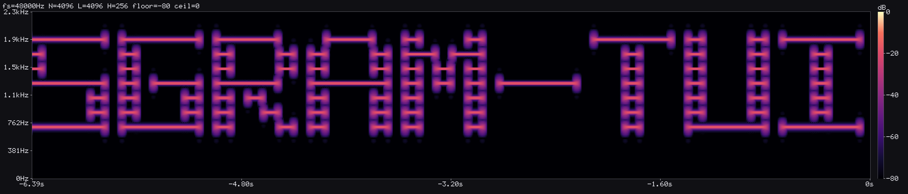
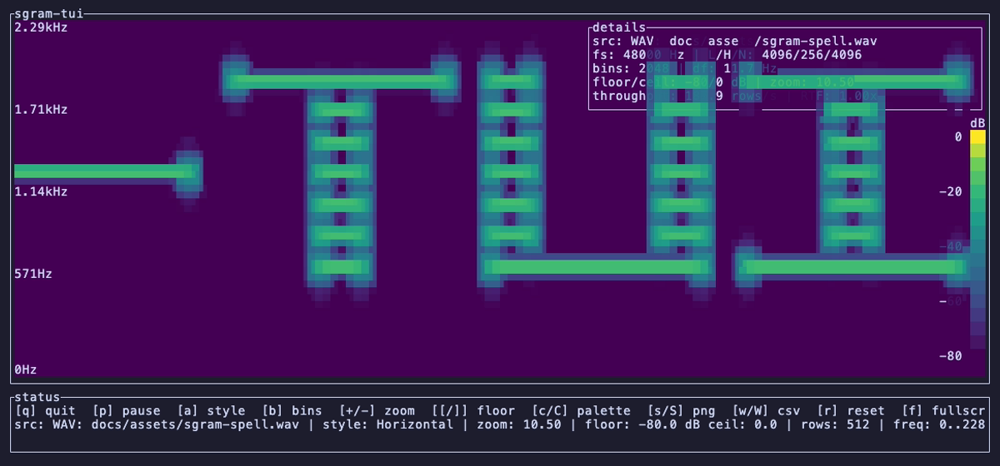

# sgram-tui &nbsp;·&nbsp; `sgram-tui`

**A calibrated spectrogram analyzer that lives where your audio work does: the terminal.**


<sub>↑ the TUI, live: a horizontal sweep writing the name of the tool — because the audio itself spells it (read on).</sub>

> **The hero image is audio.** [`scripts/spell.py`](scripts/spell.py) paints text into the
> time–frequency plane — each glyph column a slice of time, each row a sine partial — and
> `sgram-tui render` exports the labeled figure below. The image is the WAV; the WAV is in
> [`docs/assets/`](docs/assets/); the whole loop is two commands you can run yourself.



<sub>↑ `sgram-tui render docs/assets/sgram-spell.wav --palette magma --fft 4096 --zoom 10.5 --detailed` — a real export, axes and colorbar included.</sub>

[](https://crates.io/crates/sgram-tui)
&nbsp;·&nbsp; [](https://crates.io/crates/sgram-tui)
&nbsp;·&nbsp; [](LICENSE)
&nbsp;·&nbsp; Rust + ratatui · live mic or wav/mp3/flac/ogg/m4a · headless export mode

---

## Why

A GUI spectrogram means leaving the terminal your whole audio workflow lives in.
`sgram-tui` is the $50-oscilloscope answer: point it at a mic or a file and get a
**calibrated** dBFS spectrogram (window-gain-corrected — a full-scale sine reads ~0 dB
at any FFT/window size) rendered at 2×2 sub-pixels per character cell, with a mouse
hover readout of time / frequency / dB under the cursor. Not a toy palette: Viridis,
Inferno, Magma, Plasma with reference anchor colors, and max-pooled rendering so a
narrowband peak is never lost no matter how many bins share a cell.

## The instrument view



<sub>↑ `--detailed`: source metadata, fs / L/H/N / bin spacing, live throughput (rows/sec, real-time factor), dB colorbar, and every keybinding one row away.</sub>

- **Inputs**: live mic (`cpal`, device by substring), or WAV/MP3/FLAC/Ogg/M4A files with `--realtime` playback sync
- **Analysis you control**: FFT size, window length + function (Hann/Hamming/Blackman), hop, sample rate, magnitude/power dB, pre-emphasis
- **Three styles**: horizontal sweep (time→x), waterfall (time→y), instantaneous spectrum bars — cycle with `a`
- **Display science**: linear / log / mel frequency scales, zoom, dB floor/ceiling, peaks-only bin mode, overview + fullscreen
- **Measurement**: mouse hover reads time / frequency / dB in every view

## Figures out, data out

Press `s` and the current view becomes a **labeled PNG figure** — axes, tick marks, dB
colorbar, metadata title — ready for a lab notebook or a paper appendix. `w` writes
full-resolution CSV. And all of it works headless:

```sh
sgram-tui render recording.flac --png-path fig.png --csv-path data.csv --freq-scale log
```

## Install

```sh
cargo install sgram-tui
```

or from a clone:

```sh
cargo build --release        # add --no-default-features to skip mic support
./target/release/sgram-tui --help
```

Linux mic support needs `pkg-config libasound2-dev`. Uninstall: `cargo uninstall sgram-tui`.

## Quick start

```sh
sgram-tui song.mp3                              # any supported file, horizontal sweep
sgram-tui wav take.wav --realtime --normalize   # file at real-time speed
sgram-tui mic --device "BlackHole" --fps 15     # live input, device by substring
sgram-tui render take.wav --png-path fig.png    # no TUI, just the figure
```

## Controls

| key | action | key | action |
|-----|--------|-----|--------|
| `a` | cycle style | `c`/`C` | next/prev palette |
| `+`/`-` | zoom frequency range | `[`/`]` | dB floor down/up |
| `b` | all bins ⇄ peaks only | `o` | overview (fit all history) |
| `d` | details overlay | `f` | fullscreen |
| `s`/`w` | save PNG / CSV | `S`/`W` | save with path prompt |
| `p` | pause | `r` | reset history |
| `h`/`F1` | help | `q` | quit |

Mouse hover reads time / frequency / dB anywhere.

<details>
<summary><b>All flags</b></summary>

- `--fft <N>` FFT size (bin spacing fs/N) · `--win <L>` window length (zero-pads to N) · `--window hann|hamming|blackman` · `--hop <H>`
- `--sample-rate <fs>` · `--alpha 1|2` (magnitude/power dB) · `--pre-emphasis <0..1>`
- `--floor <dB>` / `--ceil <dB>` · `--zoom <z>` · `--freq-scale linear|log|mel`
- `--style horizontal|waterfall|spectrum` · `--palette <name>` · `--bins all|peaks`
- `--render quad|half|cell` (sub-pixel density) · `--resolution low|medium|high|ultra`
- `--png-path <p>` / `--csv-path <p>` · `--device <substring>` · `--overview` · `--realtime` · `--normalize` · `--clamp-floor` · `--no-mic`

Config file: `${CONFIG_DIR}/io.github/arian-shamaei/sgram-tui/config.toml` (`detailed`,
`fullscreen`, `device`, `png_path`, `csv_path`).

</details>

## Troubleshooting

- No mic device: rebuild with `--no-default-features` and use file input.
- High CPU: reduce `--fps`, increase `--hop`, or lower `--fft`.

## License

MIT
